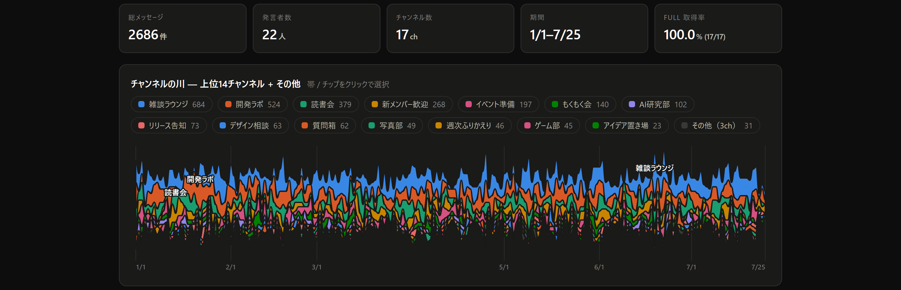
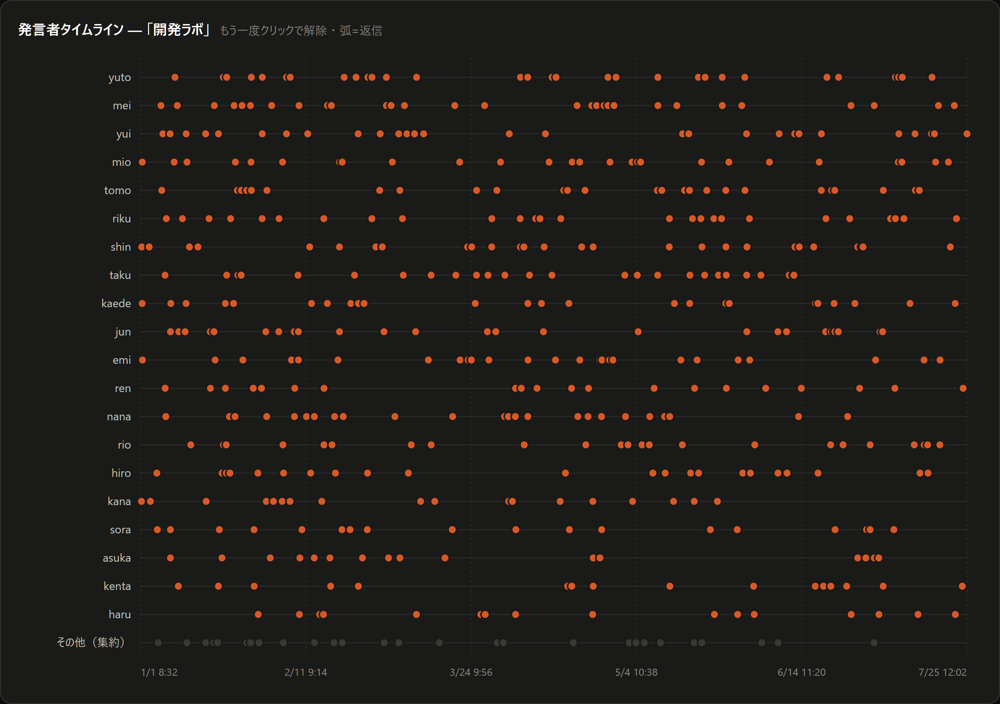
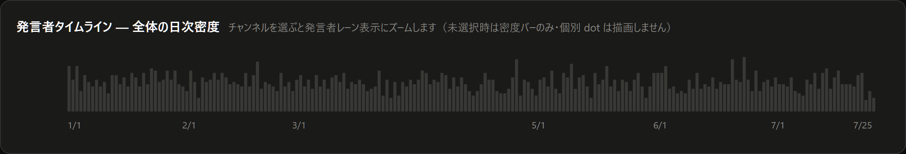
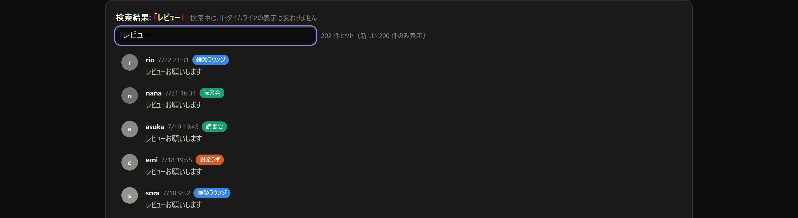

# Chronica

**Discord サーバーの会話を、話題の流れと発言者の動きとして振り返る**

 

 

数か月分の会話が、**チャンネルごとの色の帯**になって流れます。 
どこが盛り上がっていたか、何が静かになったかが、スクロールせずに見えます。

---

## 目的

Discordの長い会話履歴を、個別メッセージの羅列ではなく、
「どの話題がいつ盛り上がり、誰が参加したか」という時間の流れで振り返れるようにします。
収集・保存・閲覧はローカル完結を基本とし、Discordへの書き込み機能は持ちません。

## できること

<table>
<tr>
<td width="50%" valign="top">

### チャンネルの川
期間全体の盛り上がりを俯瞰する。 
上位14チャンネル＋その他に集約して表示。

</td>
<td width="50%" valign="top">

### 発言者タイムライン
チャンネルを選ぶと、誰がいつ発言したかへズーム。

</td>
</tr>
<tr>
<td valign="top">

### 全文検索
本文と発言者名の部分一致。日本語対応。

</td>
<td valign="top">

### リアルタイム更新
Bot 常駐で新規・編集・削除を自動追従。

</td>
</tr>
</table>

 

### 選ぶと、その人たちの動きが見える

 

### 選ぶ前は、全体の呼吸だけを見る

 

### 言葉から探す

---

## データの扱い

<table>
<tr><td>🏠</td><td><b>ローカルにのみ保存</b></td><td>収集データは SQLite に入り、外へ出ません</td></tr>
<tr><td>📦</td><td><b>リポジトリはコードだけ</b></td><td>実データ・DB・生成物・token は遮断済み</td></tr>
<tr><td>👀</td><td><b>読み取り専用</b></td><td>Discord へ書き込みません</td></tr>
<tr><td>✅</td><td><b>対象を明示指定</b></td><td>許可リストに書いたサーバーだけを収集</td></tr>
</table>

詳細 → [PROCESS_BOUNDARY.md](PROCESS_BOUNDARY.md)（やること・やらないこと）／ [SECURITY.md](SECURITY.md)（扱ってはいけないデータ）

---

## クイックスタート

AIと一緒に導入を確認する場合は、次をそのまま貼り付けられます。

> https://github.com/nexus-ai-2045/chronica を読み、この環境での導入手順を作ってください。
> 実行前に、secret・個人データ・Discord権限・外部送信・GitHub write・削除・visibility変更の
> 先に危険レビューをしてください。unknownを安全と扱わず、書き込み前に止まってください。

| | 手順 | 補足 |
|---|---|---|
| **1** | Discord Developer Portal で Bot を作る | Message Content Intent を有効に |
| **2** | サーバー管理者に導入を依頼する | 権限は View Channels と Read Message History のみ |
| **3** | `.env` に token と対象サーバーを書く | `bot/.env.example` を複製 |
| **4** | 履歴を取り込む | `bot/backfill.py` |
| **5** | 常駐して追従する | `bot/collector.py` |
| **6** | ビューア用データを出す | `bot/export_v2.py` |
| **7** | ブラウザで開く | 出力された `chronica-data.js` を `viewer/` に置いて `chronica.html` を開く（サーバー不要） |

共有したいときは、合言葉つきの単一 HTML を書き出せます（AES-256-GCM / PBKDF2 310,000 回）。 
**復号後のデータは回収できない**ので、渡す相手を決めてから使ってください。

---

## 収集と保存だけ使いたい場合

ビューアは要らず、**「Discord のログを自分の SQLite に貯める」ところだけ**が欲しい場合は、
[`bot/`](bot/) だけを見てください。**このディレクトリは単体で動きます。**

| 見るもの | ファイル |
|---|---|
| **DB 設計** | [`bot/schema.sql`](bot/schema.sql) — テーブル・トリガ・全文検索索引 |
| **収集** | [`bot/collector.py`](bot/collector.py)（常駐・リアルタイム）/ [`bot/backfill.py`](bot/backfill.py)（履歴・再開可） |
| **取り出し** | [`bot/query.py`](bot/query.py)（CLI・`--json`）/ [`bot/export_v2.py`](bot/export_v2.py)（閲覧用データ） |
| **手順** | [`bot/README.md`](bot/README.md) — Bot の作り方・必要な権限・運用 |

- `bot/` の中は `bot/` の外を参照しません。ビューア・暗号化・移行用パイプラインとは独立しています
- 外部依存は `discord.py` **1 本**だけ
- `bot/store.py` は discord.py に依存しないので、**Bot を用意する前に DB 層だけ動かして確認できます**
  （discord.py 未インストールの状態で `bot/test_store.py` を実行すると、Bot 依存の検査だけ
  自動でスキップして **78 assertions が通ります**。インストール済みなら 91）

---

## AI に渡す

ビューアで見るだけでなく、**コマンドラインから引いて LLM に渡せます**。

| やりたいこと | コマンド |
|---|---|
| 言葉で探す | `bot/query.py search <語>` |
| **要約の材料を取る** | `bot/query.py window --channel <名前> --since <日付>` |
| チャンネル一覧 | `bot/query.py channels` |
| 全体の統計 | `bot/query.py stats` |

`--json` を付けると、**そのまま LLM に渡せる形**で出ます。 
`--channel` は名前の一部でも解決します（複数該当するときは候補を出して止まります）。

検索は日本語の**2文字語でも引けます**。3文字以上は全文検索索引、2文字以下は全表走査という
使い分けで、27,797 件で 30ms 台です（[理由](docs/adr/0001-japanese-search-trigram-like-hybrid.md)）。

> `--db` はサブコマンドより**前**に置きます（例: `bot/query.py --db data/chronica.db search 開発`）。
> `.env` に `CHRONICA_DB` を書いておけば省略できます。

📁 ディレクトリ構成

 

| ディレクトリ | 役割 |
|---|---|
| `bot/` | Bot による収集（常駐・バックフィル・データ出力）→ [詳細](bot/README.md) |
| `viewer/` | 単一ファイルビューア |
| `crypto/` | 合言葉つき HTML の生成 |
| `pipeline/` | ブラウザキャプチャからの初期取り込み（移行用） |
| `data/` | ローカル専用（gitignore）。DB と生成物の置き場 |

---

## 設計上の判断

<table>
<tr>
<td width="34%" valign="top">

**重複判定は ID のみ**

本文ハッシュでの重複除去は、同じ文面の再投稿を別発言と区別できません。実測で **10.5% の欠落**を出したため廃止しました。

</td>
<td width="33%" valign="top">

**削除は物理削除しない**

削除フラグを記録し、出力時に除外します。Discord 側の削除に追従しつつ、いつ消えたかを失いません。

</td>
<td width="33%" valign="top">

**専用列に入らない情報も残す**

埋め込み・リアクション・メンションなど、列にしていない受信情報を保存し、後から解釈をやり直せるようにしています。

</td>
</tr>
</table>

---

## サイズの目安（実測）

| メッセージ数 | SQLite DB | |
|---:|---:|---|
| 27,797 | **41 MB** | 7 か月・254 チャンネル・261 名の実績値 |
| 100,000 | 約 148 MB | |
| 1,000,000 | 約 1.5 GB | |

暗号化した配布用 HTML は 27,797 件で 15 MB。配布形式には上限があるため、規模が大きくなる場合は API 経由で必要分だけ返す構成へ移ります。

---

## Discord Context Bridge との関係

[discord-context-bridge](https://github.com/nexus-ai-2045/discord-context-bridge) とは目的が異なる別ツールですが、**設計と安全境界の考え方はそちらを土台にしています**。

| | DCB | Chronica |
|---|---|---|
| **目的** | 送信**前**に文脈を把握する | 会話の**後**を振り返る |
| **時間の向き** | これから書く | 過去を読む |
| **取得** | ブラウザの可視テキスト | Discord Bot API |
| **保存** | append-only の local snippet | ローカル SQLite（全文検索つき） |

DCB から引き継いだもの — **禁止データ一覧**（実 ID・handle・本文・絶対パスを commit しない）／ **「やらないこと」を先に固定する**書き方／ **local-first・read-only を既定とし送信系を持たない**方針。

Bot を使わずローカル保存だけしたい場合は、DCB 側が使えます。

## 制約

- Discord Botの導入と対象サーバー管理者の許可が必要です。
- 復号済みの配布HTMLやローカルDBから流出したデータは回収できません。
- 大規模な履歴では、単一HTMLの容量とブラウザの処理負荷が増えます。
- スクリーンショットと数値は架空データまたは記載時点の実測であり、全環境での性能を保証しません。

---

**[📖 貢献する](CONTRIBUTING.md)** ・ **[🔐 セキュリティ](SECURITY.md)** ・ **[📋 公開前チェック](PREFLIGHT.md)**

スクリーンショットはすべて架空のデモデータです。MIT License.

